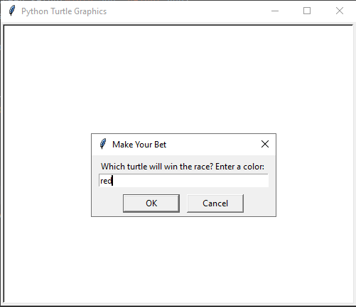

# Turtles Race

A small program written in python programming language using the turtle module, in this game you should bet on a turrle and guess the wining turtle.
There are six turtle with six colors  ["red", "orange", "yellow", "green", "blue", "purple"], you can bet on one of them and play.

### The Game Looks in Action:

